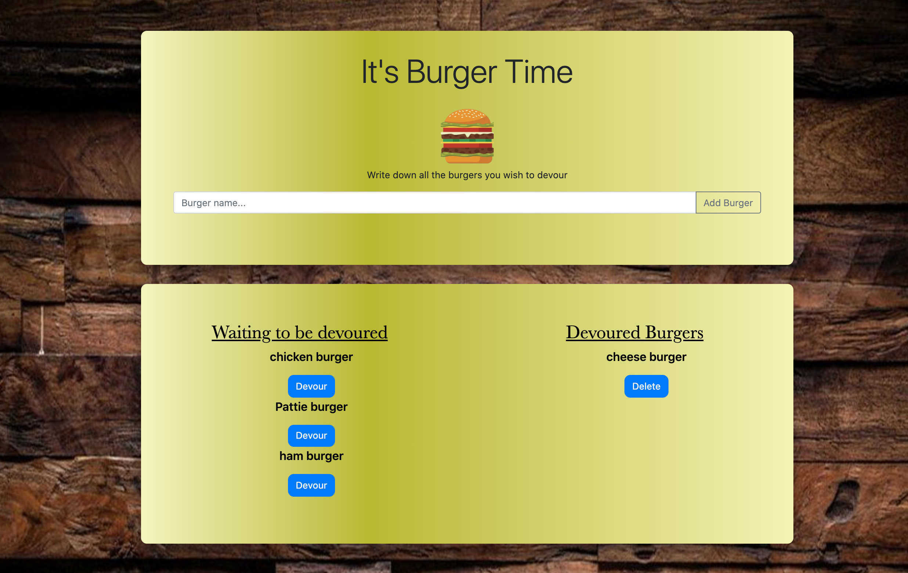

# Node Express Handlebars (Eat da Burger)

Using Node, Express, MySQL, Handlebars and a homemade ORM the goal was to create a burger logger that allows the user to input a burger name, devour and delete the burger. We also used handlebars to generate the HTML file.

# Deployment
The application is deployed onto heroku: 
https://ancient-waters-52923.herokuapp.com

# Installation
1. Clone the repository
2. Install the following on the command line: 
   * npm install express
   * npm install express-handlebars
   * npm install mySQL
3. Create a table on mySQL workbench using the schema provided on the db folder
4. Connect the file to your mySQL database in the connection.js file inside the config folder.
5. Run node server in the terminal